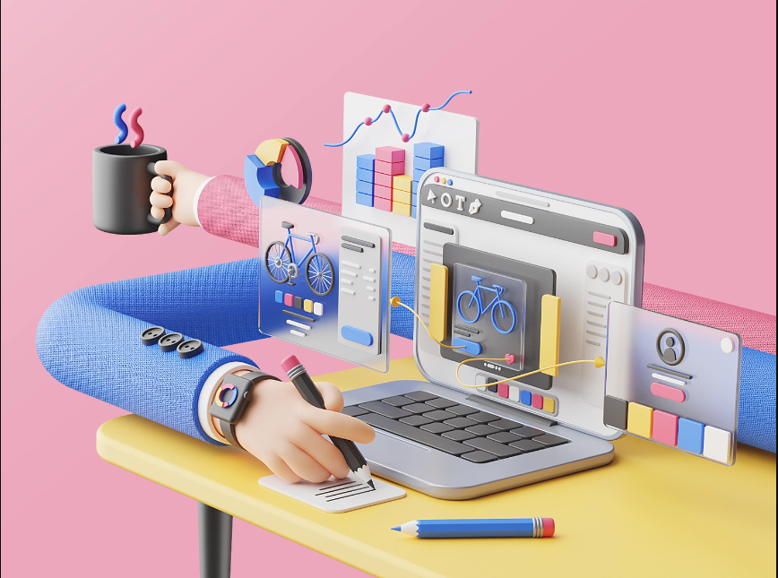

 

<h1 align="left" margin='20px' >Hello , I'm Disha Gupta</h1>
<h3 align="left" margin='20px' >A passionate and aspiring Full Stack developer from India</h3>

  

 

   
    

   

---

- 🧠 I am currently learning **Vue.js, SQL**

- 📝 I regularly write articles.

- 💬 Ask me about **TECH, AI**

- 📫 How to reach me **guptamansi201@gmail.com**

<!-- //-  -->
-  My portfolio - <a href='https://dishagup.github.io/' target='_blank'>[https://dishagup.github.io/](https://dishagup.github.io/)</a>

<h2 align="center">Connect with me:</h2>

<!--  -->

<h2 align="center">Languages and Tools:</h2>
 
  

---

<!-- <h3 align="left">Support:</h3> -->
<!-- 

   -->

&nbsp;

  

<!--  -->

## Thankyou for visiting
### Don't forgot to give a <strong>star</strong>
